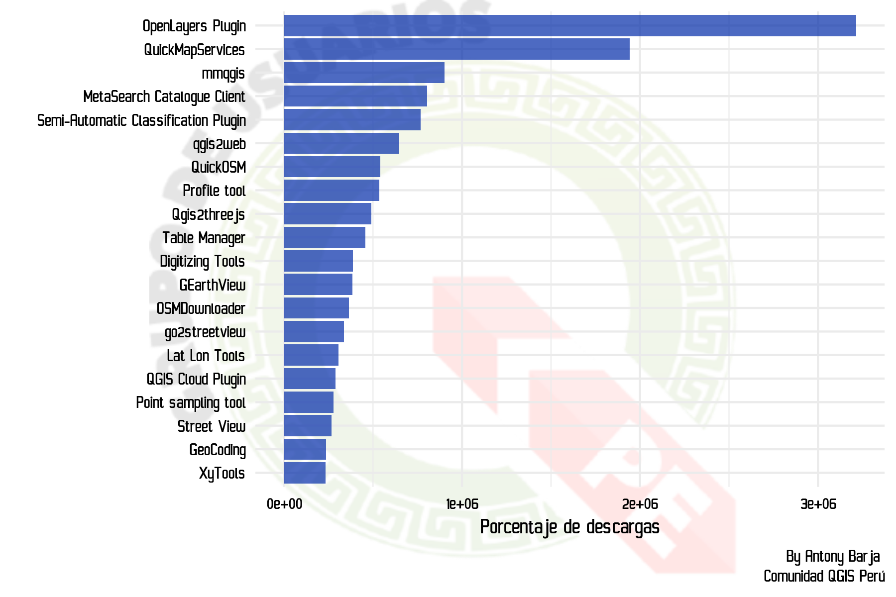
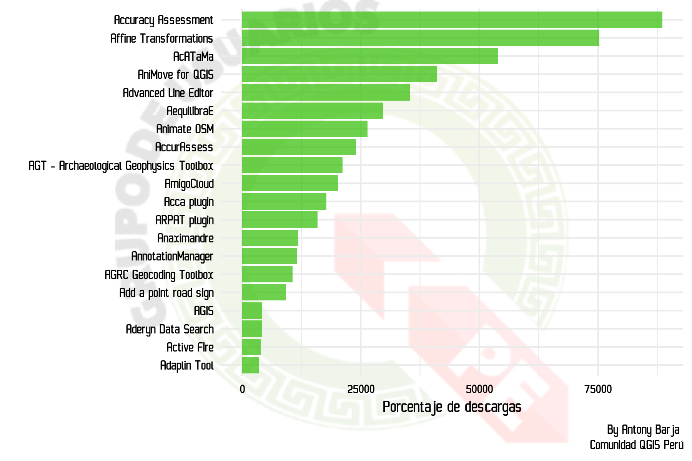

# Café con Plugins

 
 
 

 
 
  

Durante la primera semana del mes de setiembre del 2020, se lanzó una encuesta a todo la comunidad de **QGISeras** y **QGISeros** acerca de los temas de interés, como parte del cronograma de actividades agendadas por el **Grupo Oficial de Usuarios dQGIS Perú**. Se propusierón algunas temáticas referenciales, teniendo como objetivo incentivar a los usuarios y nuevos usuarios a participar y  proponer ideas. Esta encuesta fue publicada en nuestras redes sociales [**Facebook**]() y [**Twitter**](). Conforme pasaron los días, la mayoría de usuarios votó por la opción de **Plugins**, seguida de **Desarrollo de mapas temáticos**. Entonces, bajo este contexto y evidencias, el **Grupo Oficial de Usuarios QGIS Perú** comenzó un nuevo evento llamado **"Café con Plugins"**, teniendo como fecha inicial el 02 de octubre del presente año.
 

 

  
  
 

 

## Objetivos:

* Iniciar con el primer evento autodenominado "Café con Plugins".
* Orientar a los usuarios regulares y nuevos usuarios los conceptos básicos sobre los plugins.
* Mostrar los plugins más instalados y estables en la versiones de largo plazo(**LTR**: **3.10** *A Coruña*) y la última versión(**LR**: **3.14** *Pi*).
* Enseñar las formas correctas de descargar e instalar plugins.
* Evangelizar en el uso de Github.
* Colaborar con el desarrollo y testing de plugins.

## ¿Qué es un plugin?

Un **plugin** o comúnmente llamado **"complemento"**, es una herramienta externa desarollada por la comunidad científica y dinámica de QGIS, para solucionar diferentes tareas de geoprocesamiento o problemas específicos. Éstos son creados en el lenguage **Python** y **Qt designer**. La integración de Python con la API de QGIS es lo que se le conoce como **PyQGIS**.

## ¿Cómo instalar un plugin?
Para instalar un plugin solo tienes que ir a la barra de menú y dirigirte hace la opción de  **Complementos**, luego le das clik a **Administrar e instalar complementos** y digitas el nombre del plugin a instalar (para nuestro ejemplo es  **Data Plotly**), y finalmente le das click a instalar y eso es todo. Esto lo puedes encontrar también en el siguiente video.

 

## Plugins más instalados 

Dependerá de la versión con la cual estás trabajando. Recuerda que hay plugins que actualmente no tienen soporte, por ende, no son compatibles con la últimas versiones del software. Para ello te recomendamos tener instalada la LTS,  o la versión 2.18-Las Palmas-. En el siguiente gráfico mostramos los plugins más instalados hasta el momento. 

<a>Fuente:Elaboración propia con datos de QGIS</a>

## Plugins más estables 

<a>Fuente:Elaboración propia con datos de QGIS</a>

## ¿Cómo generar un issue y colaborar con el desarrollo de plugins?

Para poder colaborar con el desarrollo de un plugin existe un complemento super interesante dentro del ecosistema QGIS. Este es el famoso **Report Plugin**.  Con este **complemento** también puedes generar nuevos isuues dentro de GitHub.

 

## ¿Cómo encontrar más información con respecto a un plugin?

Para obtener mayor información acerca de los más de 700 plugins, puedes visitar la siguiente página: <https://plugins.qgis.org/>

## ¿Cómo desarrollar un plugins?
Es necesario tener conocimientos en el lenguaje de programación Python; sin embargo, dentro de QGIS existen diferentes formas de cómo puedes iniciar esta nueva aventura.

Puedes empezar, revisa el manual de **PyQGIS** o los videos elaborados por **Victor Olaya**

* Documentación de PyQGIS:: <https://docs.qgis.org/3.10/en/docs/pyqgis_developer_cookbook/>.

* Curso de Programación QGIS 3 con Python:: <https://www.youtube.com/watch?v=vZ08dYlM-7U>

 
 Todos los datos producidos en el presente proyecto se publican bajo [licencia Creative Commons (CC BY 2.5 PE)](https://creativecommons.org/share-your-work/): Es posible reproducir, distribuir, transmitir y adaptar libremente datos,  también con fines comerciales, siempre que se cite la **fuente**.
